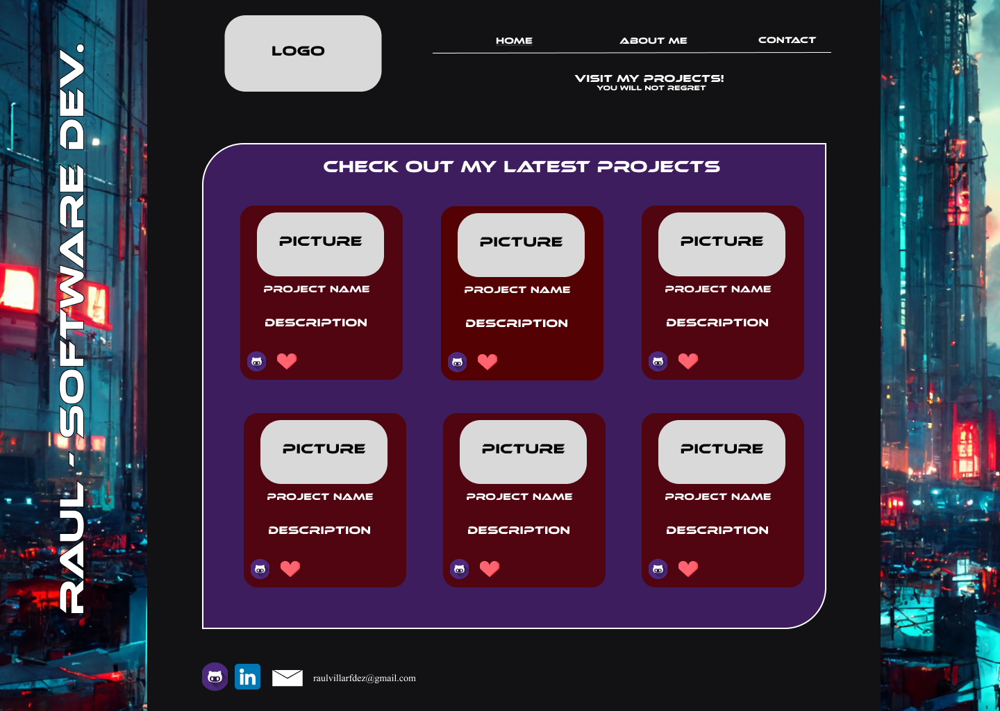
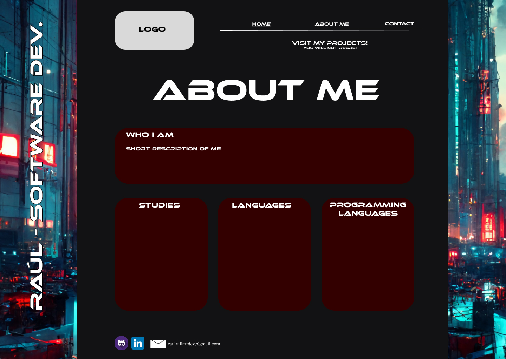
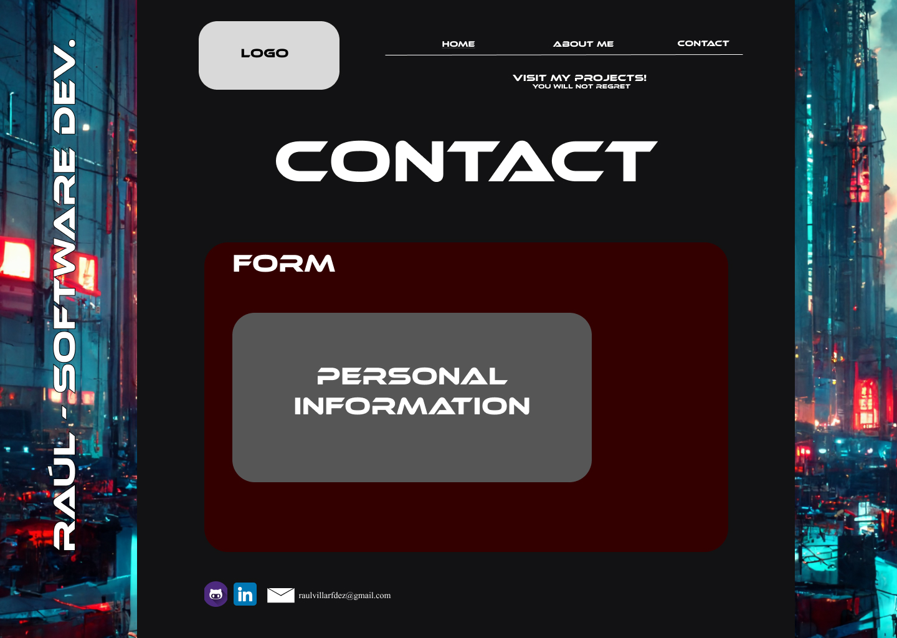
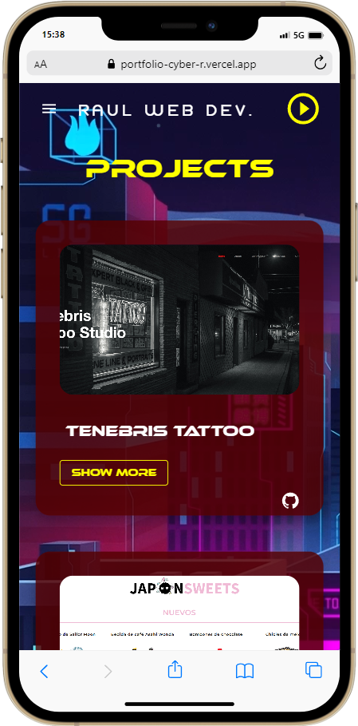
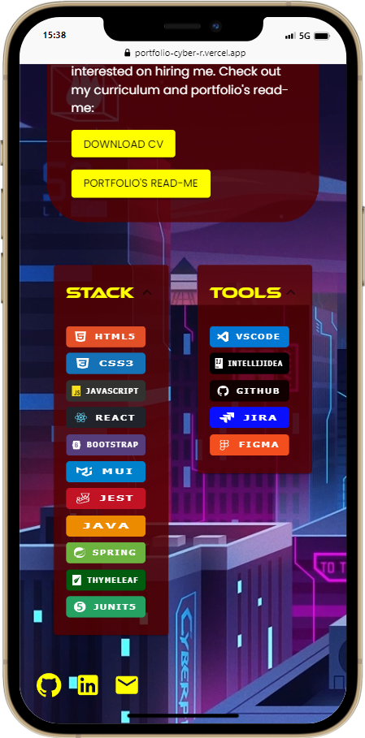
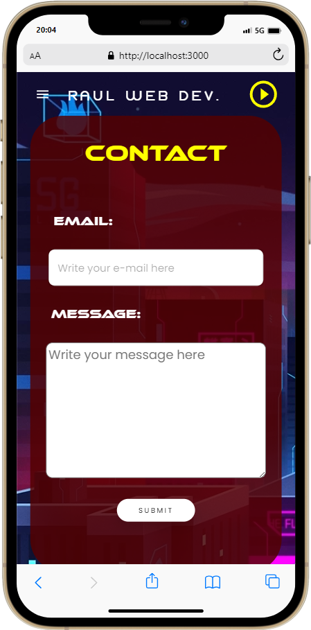
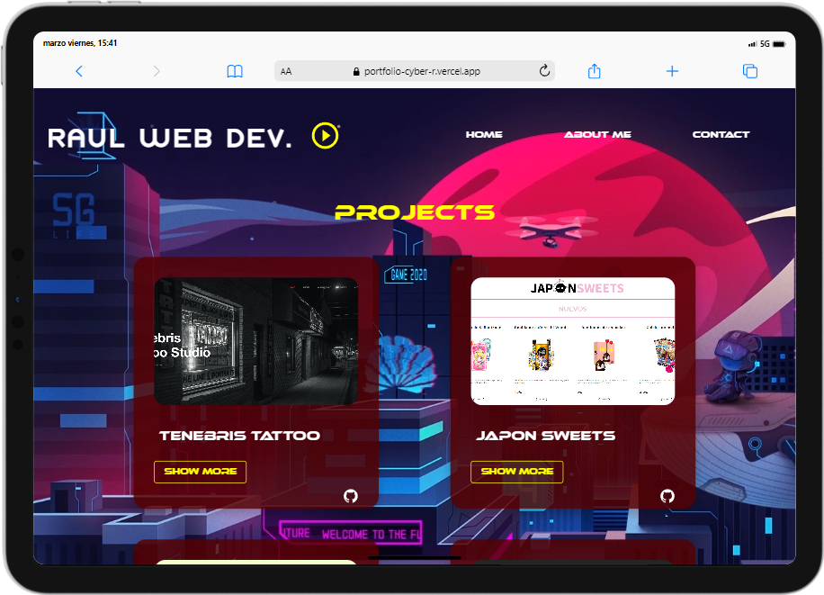
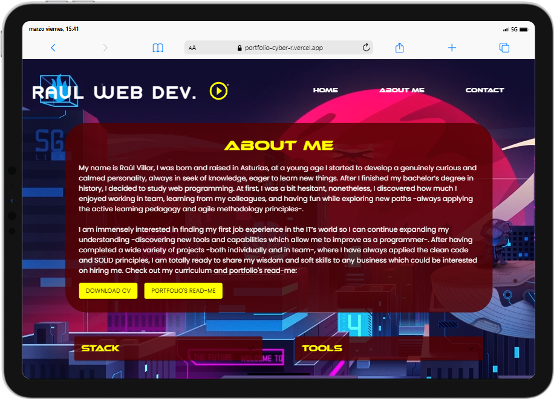
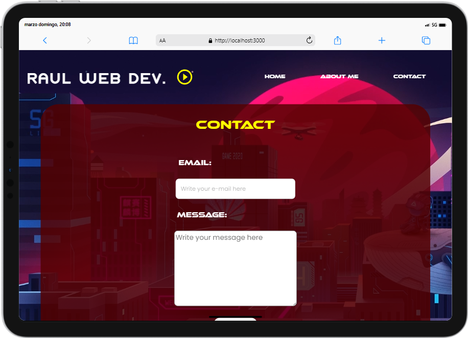

<h1 align="center">Cyber's Raúl Portfolio®</h1>

<h2>1. Descripción del proyecto:</h2>

Este proyecto desarollado en Java, mediante Spring Boot y Thymeleaf, nos permite visualizar, añadir, eliminar y actualizar (CRUD) consultas en una base de datos a 
tiempo real. Ha sido realizado mediante el entorno de desarrollo (IDE) IntelliJ, utilizando el denominado patrón de arquitectura modelo-vista-controlador, y empleando el sistema de gestión de base de datos de MySQL XAMPP / Workbench, donde se ha generado la tabla en la cual se almacena la información. 

<h2>2. Features:</h2>

<ul>
<li>Completly responsive webpage for every device.</li>
<li>Responsive navigation bar which, after reducing its size, it displays a hamburger menu -it makes it easier to navigate for mobile users-.</li>
<li>Animated background image.</li>
<li>An interactive icon which allows the user to play and pause the cyberpunk-themed background music.</li>
<li>Projects are displayed in cards: clicking the main image opens a gallery which allows the user to see the project in depth, there is also a "show more" button which, employing a modal, displays more information about the project. In addition, I have inclued a GitHub button for each card.</li>
<li>About Me: it includes a short description of my self, a button to download my CV, and the stacks which I am specialized in.</li>
<li>Contact: a completly functional form which works making use of this API "https://formspree.io" .</li>
</ul>

<h2>3. Stack 🛠️⚙️</h2>

  

<h2>4. Deployment ⚗️🧪</h2>

The deployment was made using vercel: https://portfolio-cyber-r.vercel.app

<h2>5. Mock-up</h2>

<h3>Home Page</h3>

<h3>About Me</h3>

<h3>Contact</h3>

 
<h2>6. Final Product</h2>

<h3>Home Page</h3>

<h3>About Me</h3>

<h3>Contact</h3>

<h3>Mobile version</h3>

<h3>Tablet version</h3>

